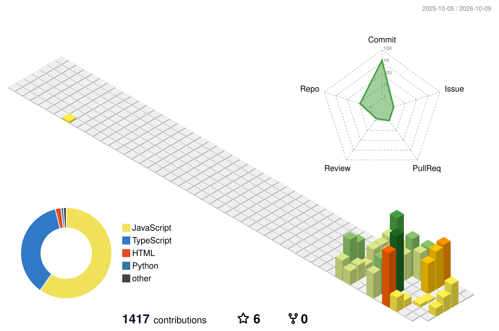

<!-- ═══ 第一屏：只放最抓眼的 —— 动态横幅 + 名字 + 一句话 ═══ -->

 

 

---

## 🎮 我在折腾什么

> 都是自己一个人写的，**点进去就能玩** ——

| 作品 | 是什么 |
|---|---|
| 🏠 **[毛毛的个人主页](https://maomao1ovo1.github.io)** | 自己写、自己托管的小站 —— 游戏 / 音乐 / 相册都在这儿 |
| 🗼 **[共鸣之塔](https://maomao1ovo1.github.io/games/td/source/game.html)** | 自己一个人写的**像素塔防**：元素共鸣、8 座塔、无尽模式，网页直接玩，也有安卓包 |
| 🎮 **[小游戏大厅](https://maomao1ovo1.github.io/games.html)** | 2048 · 贪吃蛇 · 打字 · 猜数字 · 五子棋 · 象棋 · 捕鱼 · 围棋，全带排行榜 |
| 🎵 **[NFC 一贴就听](https://maomao1ovo1.github.io/nfc-tap-9f3a/)** | 手机贴一下 NFC 挂件，直接开唱的小播放器 |
| 🪐 **[太阳系 3D](https://maomao1ovo1.github.io/solar-system/)** | 能怼近看星球的小模型（摸鱼用） |
| 📱 **[硬件测试大厅](https://maomao1ovo1.github.io/hardware-lab/)** | 免授权指纹检测 + 一键授权的手机体检 |

<!-- 技术栈徽章（带文字 + 品牌色 + 各自的 logo）—— 主位只放「关键 / 炫酷 / 权威」的那几个，
     其余收进折叠；DeepSeek 那枚必须在主位（毛毛原话"一定要有你呀"）；
     DeepSeek Harness 紧随其后（2026-10-07 毛毛要求补上，链接指向官方仓库 deepseek-ai/deepseek-harness） -->

上面是主要用到的 —— 最后两枚是一对：<b>DeepSeek</b> 给我写码 🐋，<b>DeepSeek Harness</b> 是我跑它的壳

<b>🔧 点开看完整技术栈</b>

 

还有几样用过但图标库没有的：Termux · ffmpeg · ADB · TTS 引擎 · GitHub Pages

## 🌸 我是谁

<!-- 联系方式：只放他**已经公开**的入口。
     ⚠️ 特意没有邮箱 —— 他网站主打「源码零邮箱」，不能在这儿漏出去 -->

| | |
|---|---|
| 🎒 **身份** | 学生党，职高二年级 —— 作息自由，**深夜修仙**是常态 |
| 🎮 **属性** | **二次元 × 技术宅**：聊番、聊游戏、聊手办、聊代码就来劲；跟不熟的人偏宅，熟了话很多 |
| 📱 **家当** | **没有电脑** —— 上面那些东西全靠一部能折腾的手机搞出来的 |
| 🐋 **搭子** | 有只 AI 鲸鱼叫「**小鲸**」，帮我写码、排障、当老师（边做边学） |
| 💜 **审美** | 喜欢**紫色和绿色**，越鲜艳越好；不喜欢黑白灰 |

> 一句话：**能自己动手搞出来的，就不想用现成的。**

## 💜 我喜欢

| | |
|---|---|
| 🎬 **看番** | 小马宝莉（本命 **云宝** 🌈）· 咱们裸熊 · Charlotte · 埃罗芒阿老师 · 魔女之旅…… 随缘补 |
| 🎮 **游戏** | 原神（**久岐忍**天下第一）· Muse Dash · Phigros · 星露谷 · 泰拉瑞亚 · 我的世界 · 暖雪…… |
| 🎧 **音乐** | 二次元 × 电音；**只收无损**（WAV / FLAC），还收藏 CD、磁带、光碟 —— 摸得着才叫拥有 |
| 🎛️ **手感** | 玩游戏首选**手柄**（只认原生支持那种）；界面爱吃**毛玻璃**质感 |
| 🥤 **吃喝** | 不吃辣（一点点都不行）· **咸党** · 可乐只喝**可口** |
| 🌙 **作息** | 深夜修仙，凌晨最活跃 |
| 🎪 **心愿单** | 攒钱买**人生第一台电脑** · 去一次**漫展**（还没去过）· 去**南方**看看 |

## 📊 数据

 

<b>📈 点开看更多数据</b>（贡献热力条 · 总览 · 项目卡 · 各种徽章）

 

 

---

**欢迎来我这儿玩 —— 开心最重要 🐳**

  

